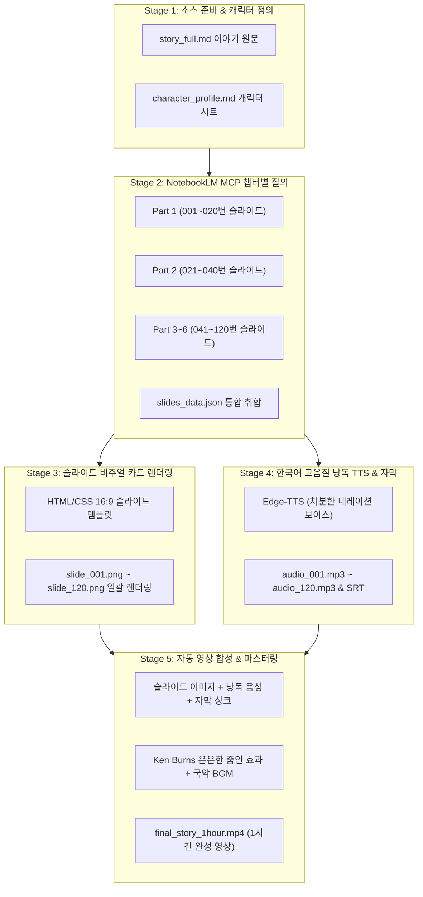

# [프로젝트 구조 설계서] NotebookLM 기반 1시간 스토리텔링 슬라이드 영상 제작 파이프라인

본 문서는 유튜브 레퍼런스 영상([소박맞은 마님을 끝까지 모신 머슴...](https://youtu.be/utYEoVZO8H4))과 같은 **1시간 분량(약 120~150개 슬라이드)의 장편 야담/오디오북/해설형 영상**을 **NotebookLM MCP 및 Antigravity 자동화 엔진**을 통해 제작하기 위한 프로젝트 아키텍처 및 파이프라인 설계서입니다.

---

## 1. 프로젝트 디렉터리 구조 (Directory Structure)

```text
c:\My_Project\src\notebooklm_slides/
├── sources/                         # [입력] 원천 텍스트 및 메타데이터
│   ├── story_full.md                # 1시간 전체 이야기 원문 (기승전결 6개 챕터)
│   ├── character_profile.md         # 캐릭터 DNA (외형, 복장, 말투, 상징 색상)
│   └── prompt_template.md           # Part별 슬라이드 추출용 NotebookLM 프롬프트
│
├── templates/                       # [비주얼] 슬라이드 카드 렌더링 템플릿
│   ├── slide_template.html          # 16:9 슬라이드 카드 HTML 템플릿 (동양풍/한지/수묵)
│   ├── style.css                    # 전통 문양 테두리, 명조 폰트, 캐릭터 뱃지 스타일
│   └── assets/                      # 배경 텍스처, 전통 문양 SVG, 캐릭터 아이콘
│       ├── hanji_bg.png
│       └── border_pattern.svg
│
├── scripts/                         # [자동화] 단계별 처리 파이썬/PowerShell 스크립트
│   ├── 01_sync_notebooklm.py        # 소스 파일 NotebookLM 업로드 및 MCP 동기화
│   ├── 02_extract_slides.py         # Part 1~6 순회하여 120개 슬라이드 JSON 추출
│   ├── 03_render_slides.py          # JSON 데이터를 16:9 4K 슬라이드 이미지(PNG)로 일괄 렌더링
│   ├── 04_generate_tts.py           # 슬라이드별 낭독 대본을 고음질 한국어 음성(MP3) 및 SRT 변환
│   └── 05_render_video.py           # 슬라이드 이미지 + 음성 + 자막 + Ken Burns 모션 + BGM 합성
│
├── output/                          # [출력] 파이프라인 단계별 산출물
│   ├── slides_data.json             # 120개 슬라이드 통합 메타데이터
│   ├── images/                      # slide_001.png ~ slide_120.png (슬라이드 카드)
│   ├── audio/                       # audio_001.mp3 ~ audio_120.mp3 (낭독 음성)
│   ├── subtitles/                   # slide_001.srt ~ slide_120.srt (자막 싱크)
│   └── final_story_1hour.mp4        # 최종 1시간 마스터링 완성 영상
│
├── run_pipeline.py                  # [통합] 1단계부터 5단계까지 원클릭 일괄 실행 마스터 스크립트
├── NOTEBOOKLM_MCP_SETUP.md          # NotebookLM MCP 계정 및 프로필 설정 문서
└── PROJECT_ARCHITECTURE.md          # 본 설계서 문서
```

---

## 2. 전체 파이프라인 워크플로우 (5-Stage Pipeline)



---

## 3. 핵심 모듈별 설계 상세

### 3.1 캐릭터 일관성 제어 규칙 (`character_profile.md`)
- **원칙**: 모든 슬라이드에서 등장인물의 외형, 복식, 어투, 상징 색상을 일관되게 고정.
- **규격**:
  - `[인물명]`: 돌쇠 (머슴)
  - `[외형/의상]`: 20대 후반, 짙은 눈썹, 상투, 짚신, 남색 삼베 저고리 고정
  - `[말투/어조]`: 공손하고 묵직한 하오체/존댓말
  - `[테마 컬러]`: `#1E293B` (남색)
  - `[UI 뱃지]`: 슬라이드 상단에 인물명 뱃지 및 아이콘 표시

---

### 3.2 슬라이드 메타데이터 데이터 구조 (`slides_data.json`)
NotebookLM에서 추출되어 저장되는 표준 슬라이드 JSON 포맷:
```json
[
  {
    "slide_index": 1,
    "part_number": 1,
    "chapter_title": "제1막: 버려진 오두막의 눈물",
    "character_name": "윤씨 마님",
    "character_theme": "#7C3AED",
    "emotion": "슬픔과 비통",
    "slide_screen_text": "깊은 산골 버려진 오두막,\n마님은 홀로 눈물을 흘리고 있었습니다.",
    "voice_script": "달빛마저 숨어버린 깊은 밤, 낡은 오두막 안에서 마님은 옷고름을 적시며 홀로 흐느끼고 있었습니다.",
    "visual_background_style": "dark_forest_cabin",
    "estimated_duration_sec": 25.5
  }
]
```

---

### 3.3 16:9 슬라이드 카드 비주얼 템플릿 (`slide_template.html`)
- **해상도**: 1920x1080 (16:9 1080p) 또는 3840x2160 (4K)
- **디자인 컨셉**:
  - 전통 한지 질감 및 먹물 번짐 그러데이션 배경
  - 조선시대 전통 기와/창호 격자 문양의 얇은 금박 테두리
  - 상단: 챕터 제목 및 현재 씬 번호 (`[001 / 120]`)
  - 중앙: 감성적 명조 폰트로 가독성을 극대화한 핵심 문장 (2~3줄)
  - 좌/우측: 발화자(캐릭터) 전용 뱃지 및 상징 컬러 라인
  - 하단: 유튜브 시청자를 위한 자동 스크롤 자막 영역 여백 확보

---

### 3.4 1시간 영상 구성 및 파트 분할 표 (Part 1 ~ Part 6)

| 파트 번호 | 이야기 단계 | 타임코드 | 슬라이드 번호 | 분량 |
| :---: | :---: | :---: | :---: | :---: |
| **Part 1** | 발단: 마님의 몰락과 돌쇠의 다짐 | 00:00 ~ 10:00 | Slide 001 ~ 020 (20장) | 약 10분 |
| **Part 2** | 전개: 산골 오두막의 새로운 삶과 헌신 | 10:00 ~ 20:00 | Slide 021 ~ 040 (20장) | 약 10분 |
| **Part 3** | 위기: 한양에서 닥쳐온 위협의 그림자 | 20:00 ~ 30:00 | Slide 041 ~ 060 (20장) | 약 10분 |
| **Part 4** | 발전: 돌쇠의 비밀스러운 밤 외출과 의문 | 30:00 ~ 40:00 | Slide 061 ~ 080 (20장) | 약 10분 |
| **Part 5** | 절정: 머슴 돌쇠의 진짜 신분과 거대한 반전 | 40:00 ~ 50:00 | Slide 081 ~ 100 (20장) | 약 10분 |
| **Part 6** | 결말: 은혜 갚은 머슴의 마지막 진실과 여운 | 50:00 ~ 60:00 | Slide 101 ~ 120 (20장) | 약 10분 |
| **합계** | **총 6개 챕터 완성 서사** | **00:00 ~ 60:00** | **총 120장 슬라이드** | **약 60분 (1시간)** |

---

## 4. 실행 및 관리 가이드

### 단계별 스크립트 실행 명령어
```powershell
# 1. NotebookLM에 소스 동기화
python .\scripts\01_sync_notebooklm.py

# 2. 6개 파트 120개 슬라이드 데이터 일괄 추출
python .\scripts\02_extract_slides.py

# 3. 16:9 슬라이드 카드 이미지 120장 일괄 렌더링
python .\scripts\03_render_slides.py

# 4. 한국어 낭독 음성(TTS) 및 SRT 자막 일괄 생성
python .\scripts\04_generate_tts.py

# 5. 최종 1시간 MP4 영상 렌더링
python .\scripts\05_render_video.py

# 또는 원클릭 마스터 실행:
python .\run_pipeline.py
```
