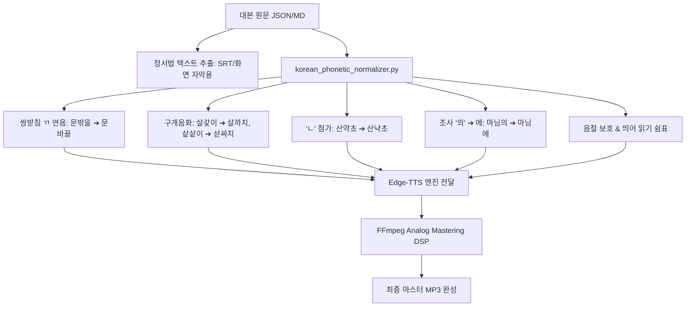

# 🎙️ [송림야담] 한국어 표준 발음 및 AI 음성 마스터 가이드 (Korean Pronunciation & Phonics Standard)

본 문서는 **국립국어원 《표준 발음법》(문교부고시 제88-2호 / 문화체육관광부고시 최신 개정판)** 및 실제 방송/야담 전문 성우의 낭독 규범을 바탕으로 작성된 **송림야담 오디오북 & 쇼츠 제작 공식 음성 표준 지침서**입니다.

---

## 📌 1. 총칙 및 기본 원칙

* **제1항**: 표준 발음법은 표준어의 실제 발음을 따르되, 국어의 전통성과 합리성을 고려하여 정함을 원칙으로 한다.
* **오디오북 낭독 원칙**:
  1. 기계적 1:1 글자 읽기를 엄격히 금지하며, 문맥과 형태소 경계에 따른 **자연스러운 구어체 연음과 음운 변동**을 적용한다.
  2. **화면 표기(자막)와 발음 데이터(TTS)를 2-Track으로 분리**한다.
     * **화면 자막(SRT/HTML)**: 한글 맞춤법 정서법 준수 (예: `문밖을`, `마님의`, `살갗이`, `눈빛엔`, `산약초`)
     * **TTS 음성 주입**: 국립국어원 표준 연음 음성 변환 (예: `문바끌`, `마님에`, `살까치`, `눈비첸`, `산냑초`)

---

## 📌 2. 제2장 자음과 모음 / 조사 '의'의 발음 (★ 최우선 적용)

### [제5항] 이중모음 및 '의'의 발음 규정
1. **자음을 첫소리로 가지고 있는 음절의 'ㅢ'**: [ㅣ]로 발음한다.
   * `늴리리` ➔ **[닐리리]**, `희망` ➔ **[히망]**, `무늬` ➔ **[무니]**
2. **단어의 첫음절 이외의 '의'**: [ㅣ]로 발음함을 허용한다.
   * `민주주의` ➔ **[민주주의 / 민주주이]**, `협의` ➔ **[혀븨 / 혀비]**
3. **관형격 조사 '의'**: **[에]로 발음함을 표준으로 적극 권장한다.**
   * `문밖의` ➔ **[문바께]** (TTS 입력: `문바께`)
   * `마님의` ➔ **[마니메]** (TTS 입력: `마님에`)
   * `가문의` ➔ **[가무네]** (TTS 입력: `가문에`)
   * `그의` ➔ **[그에]**, `자신의` ➔ **[자신에]**, `밤의` ➔ **[밤에]**

---

## 📌 3. 제3장 음의 길이 및 수사/극적 강조 장음화 (Vowel Lengthening & Emphasis)

### [제6항 & 제7항] 음의 장단 및 극적 강조 장음
* 특정 수사나 단호한 명령, 살기 어린 서사 대목에서 단어를 짧게 붙여 발음하면 경박해지므로, 첫음절을 길게 늘여(장음화) 발음하여 서사의 무게감과 살기를 고조시킨다.
  * 수정 전: `한 놈도 살려두지 마라` ➔ [한놈도] (단음으로 빠르게 발화되어 경박함) ❌
  * **수정 후**: **`단 한 놈도 살려두지 말라는`** ➔ **[단 한 놈도]** (서슬 퍼런 김판서의 살기 어린 명령 완벽 구현) ⭕

---

## 📌 4. 제4장 받침의 발음 및 연음 법칙 (Liaison & Batchim)

### [제13항] 홑받침과 쌍받침의 모음 연음 (★ 핵심 보강)
홑받침이나 쌍받침이 모음으로 시작된 조사나 어미, 접미사와 결합되는 경우에는, **제 음가대로 뒤 음절 첫소리로 옮겨 발음**한다.
* **쌍받침 'ㄲ' 연음**:
  * `문밖을` ➔ **[문바끌]** (TTS 입력: `문바끌` / [문박글]로 발음 시 중대 오류) ⚠️
  * `문밖은` ➔ **[문바끈]** (TTS 입력: `문바끈`)
  * `문밖이` ➔ **[문바끼]** (TTS 입력: `문바끼`)
  * `문밖으로` ➔ **[문바끄로]** (TTS 입력: `문바끄로`)
  * `문밖에서` ➔ **[문바께서]** (TTS 입력: `문바께서`)
  * `창밖을` ➔ **[창바끌]**, `밖을` ➔ **[바끌]**, `꺾어` ➔ **[꺼꺼]**
* **받침 'ㅊ' 연음 및 음가 교정 (제13항)**:
  * `달빛` ➔ **[달삧]** (TTS 입력: `달삧` / [달빋]의 ㅊ 음가 유지 및 선명한 종성 실현) ⚠️
  * `달빛 아래` ➔ **[달비차래]** (TTS 입력: `달비차래`)
  * `달빛이` ➔ **[달비치]**, `달빛은` ➔ **[달비츤]**, `달빛을` ➔ **[달비츨]**, `달빛에` ➔ **[달비체]**
  * `눈빛엔` ➔ **[눈비첸]** (TTS 입력: `눈비첸` / [눈비덴] 오독 방지) ⚠️
  * `눈빛이` ➔ **[눈비치]**, `눈빛을` ➔ **[눈비츨]**, `빛이` ➔ **[비치]**
* **받침 'ㅈ' 연음**:
  * `밤낮을` ➔ **[밤나즐]**, `젖은` ➔ **[저즌]**

### [제14항] 겹받침의 모음 연음
겹받침이 모음으로 시작된 조사나 어미, 접미사와 결합되는 경우에는, **뒤엣것만을 뒤 음절 첫소리로 옮겨 발음**한다.
* `닭을` ➔ **[달글]**, `흙을` ➔ **[흘글]**, `맑아` ➔ **[말가]**
* `넋을` ➔ **[넉슬]**, `넋이` ➔ **[넉시]**, `몫을` ➔ **[목슬]** (ㅅ은 연음 시 [ㅆ/ㅅ]으로 발음)
* `값을` ➔ **[갑슬]**, `없어` ➔ **[업써]**

---

## 📌 5. 제5장 음의 동화 및 구개음화 (Palatalization & Assimilation)

### [제17항] 구개음화 (ㄷ, ㅌ 받침 + '이' 접미사)
받침 'ㄷ, ㅌ(ㄾ)'이 모음 '이'나 반모음 'ㅣ'로 시작되는 형식 형태소와 만나면 [ㅈ, ㅊ]으로 발음한다.
* `살갗이` ➔ **[살까치]** (TTS 입력: `살까치` / [살가지] 오독 엄격 방지) ⚠️
* `샅샅이` ➔ **[삳싸치]** (TTS 입력: `삳싸치`)
* `굳이` ➔ **[구지]**, `같이` ➔ **[가치]**, `붙이다` ➔ **[부치다]**

### [제18항 & 제20항] 비음화 및 유음화
* `10년 / 십 년` ➔ **[심 년]** (TTS 입력: `심 년`)
* `100년 / 백 년` ➔ **[뱅 년]** (TTS 입력: `뱅 년`)
* `신문로` ➔ **[신문노]**, `군량미` ➔ **[군냥미]**

---

## 📌 6. 제6장 경음화(된소리되기) 및 사잇소리 현상

### [제23항] 받침 뒤의 된소리되기 및 서사 어휘 경음화
* `월이댁` ➔ **[월이땍]** (TTS 입력: `월이땍` / 주막 노파의 토속적이고 구수한 사잇소리 경음화) ⚠️
* `거센` ➔ **[거쎈]** (TTS 입력: `거쎈` / 거센 여울목의 거센 기세를 살리는 경음화) ⚠️
* `거세게` ➔ **[거쎄게]**
* `달빛조차` ➔ **[달비쪼차]**, `손가락질` ➔ **[손까락찔]**

### [제29항] 합성어 및 파생어에서의 'ㄴ' 첨가 (★ 핵심)
합성어 및 파생어에서 앞 단어나 접두사의 끝이 자음이고 뒤 단어나 접미사의 첫음절이 '이, 야, 여, 요, 유'인 경우에는, **'ㄴ' 음을 첨가하여 [니, 냐, 녀, 뇨, 뉴]로 발음**한다.
* `산약초` ➔ **[산냑초]** (TTS 입력: `산냑초` / [사냑초] 오독 엄격 방지) ⚠️
* `맨입` ➔ **[맨닙]**, `솜이불` ➔ **[솜니불]**, `눈요기` ➔ **[눈뇨기]**

---

## 📌 7. 제10장 호흡과 띄어 읽기(Phrasing & Pauses) 규범

1. **배경 제시 부사어의 분절 휴지**:
   * `도성 안, 비밀 가옥에서` ➔ [도성 안] (반박자 쉼) [비밀 가옥에서]
2. **목적어/주어와 방향/처소 부사어 사이의 분절 휴지**:
   * `상처 난 손을, 등 뒤로 감추며` ➔ [손을] (반박자 쉼) [등 뒤로 감추며]
   * `사병들의 거친 고함과 횃불이, 등 뒤 턱밑까지 바짝 쫓아왔고` ➔ [횃불이] (반박자 쉼) [등 뒤 턱밑까지]
3. **막 전환 예고 및 챕터 연결 분절 휴지**:
   * `숨겨진 진실은 다음, 제2막으로 이어집니다` ➔ [다음] (반박자 여운 쉼) [제이마그로]
4. **신분/호칭 명사와 인명 사이의 분절 휴지**:
   * `주막 노파, 월이댁은` ➔ [노파] (반박자 쉼) [워리대근]
5. **관형사형 종결구와 핵심 명사구 사이의 비장미 분절 휴지**:
   * `뽑아 들어야 할, 결전의 시간이` ➔ [들어야 할] (반박자 비장 쉼) [결저네 시가니]
6. **접속 부사 및 전환 접속사의 독립 휴지**:
   * `그때,`, `한편,`, `하지만,` ➔ 독립된 호흡 반점 부여

---

## 📌 8. 음성 합성(TTS) 파이프라인 자동 적용 워크플로우

